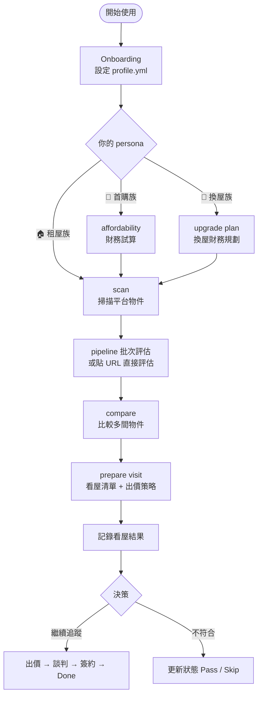
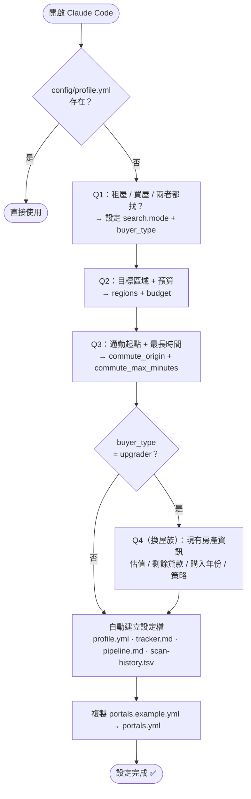
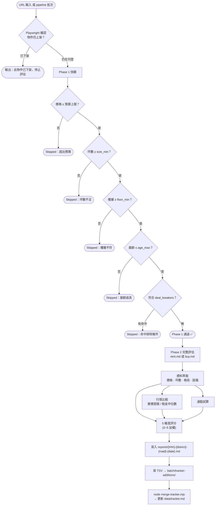
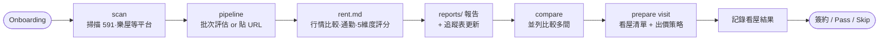
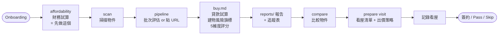
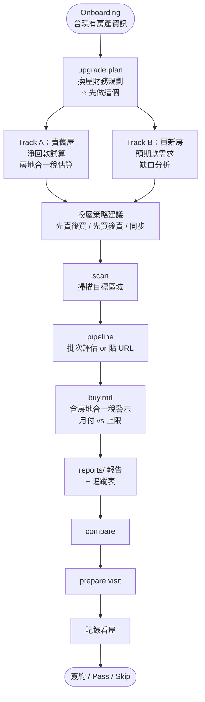
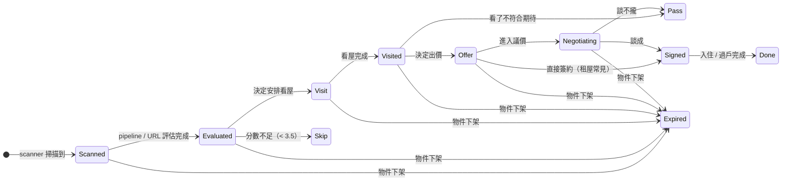

# tw-house-ops — 使用教學

本教學依三種使用者 persona 分別說明完整工作流程。找到自己的情境，照著走就對了。

---

## Persona 一覽

| Persona | 設定 | 主要用到的模式 |
|---------|------|--------------|
| 🏠 **租屋族** (Renter) | 找租屋，無自有房產 | scan、rent、compare、visit |
| 🔑 **首購族** (First-time buyer) | 人生第一次買房 | afford、scan、buy、compare、visit |
| 🔄 **換屋族** (Upgrader) | 已有房產，計劃賣舊買新 | switch、afford、scan、buy、compare、visit |

### 整體流程比較



---

## 第一次使用：Onboarding

不管哪個 persona，**第一次開啟 Claude Code 時**，系統會自動偵測缺少設定檔，啟動 Onboarding 流程。



Claude 會依序問你問題（約 5 分鐘），完成後生成：
- `config/profile.yml` — 個人設定（永遠不會被系統更新覆寫）
- `data/tracker.md` — 物件追蹤表
- `data/pipeline.md` — 待評估 URL 收件匣
- `portals.yml` — 各平台掃描設定

---

## 物件評估流程（共用）

所有 persona 的物件評估都走同一套兩階段流程：



---

## Persona A：租屋族 (Renter)

> **情境：** 工作換了，需要在台北市信義區或大安區找一間 2 房租屋，預算 25,000/月，上班地點在信義區。

### 工作流程



### Step 1：Onboarding 設定

```
Q: 租屋、買屋、或兩者都找？
A: 租屋

Q: 目標區域？
A: 台北市，信義區、大安區

Q: 月租上限？
A: 25,000

Q: 通勤起點？
A: 台北市信義區松仁路100號（公司地址）

Q: 最長通勤時間？
A: 30 分鐘
```

### Step 2：掃描新物件

```
你：scan
```

Claude 啟動背景 agent，透過 Playwright 瀏覽 591、樂屋等平台，套用區域和預算條件，去除重複物件後輸出：

```
Portal Scan — 2026-04-08
━━━━━━━━━━━━━━━━━━━━━━━━
平台掃描: 4
物件找到: 47 total
快篩通過: 12 qualified
重複略過: 8 skipped_dup
標題不符: 27 skipped_title
新增至 pipeline.md: 12
  + 信義區 | 591 | 23,000/月 | 18坪 | 2房1衛
  + 大安區 | 樂屋 | 22,500/月 | 16坪 | 2房1廳1衛
  ...
```

### Step 3：批次評估 pipeline

```
你：pipeline
```

Claude 逐一評估 `data/pipeline.md` 裡的物件。**或貼單一 URL 直接評估：**

```
你：https://rent.591.com.tw/rent-detail-12345678.html
```

範例評分輸出：

| 維度 | 分數 | 主要因素 |
|------|------|---------|
| 價格合理性 | 4.0/5 | 租/坪 低於同區行情 8% |
| 空間與格局 | 3.5/5 | 18坪，格局方正，無電梯 |
| 區域生活機能 | 4.5/5 | 步行 8 分鐘到象山站 |
| 物件條件 | 3.5/5 | 屋齡 22 年，有冷氣熱水器 |
| 風險/潛力 | 4.0/5 | 無明顯疑點，屋主自管 |
| **綜合** | **3.9/5** | 持保留態度 |

### Step 4：比較多間物件

```
你：compare 001, 003, 005
```

> "如果只能看一間，建議優先看報告 003 — 大安區仁愛路，因為綜合分最高（4.2/5），且通勤在 20 分鐘內。"

### Step 5：準備看屋

```
你：prepare visit for 003
```

Claude 生成：通用看屋清單、物件專屬清單（從報告疑點衍生）、出價策略表（掛牌價 vs 實登行情 vs 建議出價 vs 底線）。

### Step 6：記錄看屋結果

```
你：我看完 003 了，想記錄一下
```

填完後記錄表格，Claude 自動更新追蹤表狀態 `Visit` → `Visited`。

---

## Persona B：首購族 (First-time buyer)

> **情境：** 月薪 8 萬，存款 150 萬，未滿 40 歲，想在台北市大安區或中山區買第一間房，不確定預算夠不夠。

### 工作流程



### Step 1：Onboarding 設定

```
Q: 租屋、買屋、或兩者都找？
A: 買屋（第一次買，沒有自有房產）

Q: 目標區域？
A: 台北市，大安區、中山區

Q: 總價上限？
A: 1,500 萬（但不確定是否實際）

Q: 最高月付？
A: 35,000

Q: 通勤起點？
A: 台北市中正區忠孝西路（公司）

Q: 最長通勤時間？
A: 40 分鐘
```

系統自動設定 `buyer_type: first_time`，`finance.youth_loan_eligible: true`（依年齡）。

### Step 2：先做財務試算（強烈建議）

```
你：affordability
```

Claude 計算各方案的可負擔房價：

| 方案 | 利率 | 最高房價 | 頭期款 | 月付 | 30年總利息 |
|------|------|----------|--------|------|------------|
| ★ 青安 20% | 1.775% | 1,350萬 | 270萬 | 33,600 | 466萬 |
| ★ 青安 30% | 1.775% | 1,150萬 | 345萬 ⚠️ | 28,700 | 398萬 |
| 一般 20% | 2.1% | 1,200萬 | 240萬 | 33,700 | 614萬 |
| 一般 30% | 2.1% | 1,020萬 | 306萬 ⚠️ | 28,800 | 523萬 |

⚠️ 存款不足

加上各區行情比對：

| 區域 | 行情中位數/坪 | 預算可買坪數 | 是否足夠 (≥12坪) |
|------|--------------|-------------|----------------|
| 中山區 | 75萬/坪 | 18坪 | ✅ 足夠 |
| 大安區 | 115萬/坪 | 11.7坪 | ⚠️ 不足 |

### Step 3：掃描 + 評估

和租屋族相同（`scan` → `pipeline` 或貼 URL），評估報告額外包含：

- **貸款試算表**（青安 vs 一般，20%/30% 頭期）
- **建物年份風險旗標**（921 前建物、輻射屋、海砂屋）
- **買屋版評分**（價格合理性權重 35%）

### Step 4–6：比較 → 看屋 → 記錄

與租屋族相同，使用 `compare`、`prepare visit`、看屋後記錄。

---

## Persona C：換屋族 (Upgrader)

> **情境：** 目前住新北市板橋，2018 年以 900 萬買入，估值約 1,200 萬，剩餘房貸 400 萬。計劃換到台北市內湖區，目標總價 2,000 萬。

### 工作流程



### Step 1：Onboarding 設定

```
Q: 租屋、買屋、或兩者都找？
A: 買屋（已有自用房產，計劃換屋）

Q: 目標區域？
A: 台北市，內湖區、中山區

Q: 總價上限？
A: 2,000 萬

Q: 最高月付？
A: 50,000

Q: 通勤起點？
A: 台北市內湖區港墘路（公司）

Q: 最長通勤時間？
A: 30 分鐘

Q（換屋族補充）: 現有房產估值？
A: 1,200 萬

Q: 剩餘房貸？
A: 400 萬

Q: 購入年份？
A: 2018

Q: 換屋策略？
A: 先賣後買
```

### Step 2：換屋財務規劃（建議第一步）

```
你：upgrade plan
```

**Track A：賣掉現有房產**

| 項目 | 金額 |
|------|------|
| 預估售價 | 1,200 萬 |
| 未還房貸 | −400 萬 |
| 交易成本 (6%) | −72 萬 |
| 房地合一稅（持有 8 年，稅率 20%）| −24 萬 |
| **淨回款** | **704 萬** |

**Track B：買新房頭期款需求**

| 方案 | 目標總價 | 頭期款需求 | 淨回款 | 缺口 |
|------|---------|-----------|--------|------|
| 20% 頭期 | 2,000 萬 | 400 萬 | 704 萬 | 無（剩 304 萬） |
| 30% 頭期 | 2,000 萬 | 600 萬 | 704 萬 | 無（剩 104 萬） |

### Step 3：掃描 + 評估

```
你：scan
```

評估報告除了一般買屋分析外，還包含換屋族專屬的房地合一稅警示與月付上限確認。

### Step 4–6：比較 → 看屋 → 記錄

與首購族相同流程。

---

## 追蹤表狀態機



你可以直接跟 Claude 說 "把 003 改成 Visit 狀態" 或 "003 我決定不追了"，它會更新 `data/tracker.md` 對應欄位。

---

## 常用指令速查

| 指令 | 說明 |
|------|------|
| `scan` | 掃描所有平台，新物件加入 pipeline |
| `pipeline` | 批次評估 pipeline 中所有待處理物件 |
| `{URL}` | 直接評估單一物件 |
| `compare 001, 003` | 比較指定報告 |
| `compare all Evaluated` | 比較所有已評估物件 |
| `prepare visit for 001` | 產生 001 的看屋清單和出價策略 |
| `affordability` | 試算可負擔房價（首購族） |
| `upgrade plan` | 換屋財務規劃（換屋族） |
| `tracker` | 顯示追蹤表摘要 |

---

## 重要原則

- **Claude 永遠不會代你送出 offer、簽約或送出任何申請**。填表、起草文件、準備 offer 摘要都可以，但最後一步由你決定。
- 評分低於 **3.5/5** 的物件，Claude 會明確建議不要追蹤。
- 所有個人設定（`config/profile.yml`、`modes/_profile.md`）**系統更新永遠不會覆蓋**。
